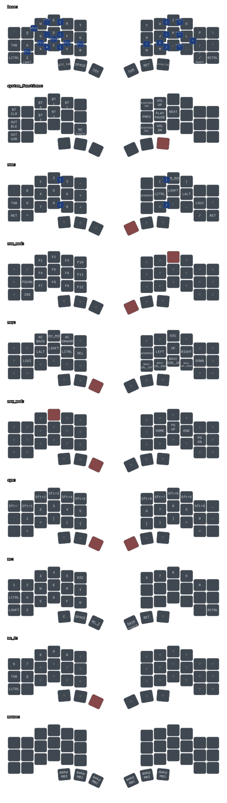

# my map (2)

For the Toucan 2, with a keymap that is largely the same as [my Kyria](https://github.com/akioweh/zmk-config).



## Compilation

Install Git, CMake, Ninja, [uv](https://docs.astral.sh/uv/getting-started/installation/), and [Zephyr SDK 0.17.0](https://zmk.dev/docs/development/local-toolchain/setup/native).

In this repo (root), run:

```sh
./setup.sh
```

(Rerun after changing `west.yml`.)

### First build

```sh
export ZEPHYR_TOOLCHAIN_VARIANT=zephyr
config_repo="$PWD"
cd .build

uv run west build \
  zmk/app -d build/left -b xiao_ble//zmk -- \
  '-DSHIELD=toucan_left rgbled_adapter' \
  "-DZMK_CONFIG=$config_repo/config" \
  "-DZMK_EXTRA_MODULES=$config_repo"

uv run west build \
  zmk/app -d build/right -b xiao_ble//zmk -- \
  '-DSHIELD=toucan_right rgbled_adapter' \
  "-DZMK_CONFIG=$config_repo/config" \
  "-DZMK_EXTRA_MODULES=$config_repo"
```

Add `-p` to these commands for pristine (re)builds.

### Subsequent builds

(Once build dirs are generated, the above parameters are cached.)

```sh
export ZEPHYR_TOOLCHAIN_VARIANT=zephyr
cd .build
uv run west build -d build/left
uv run west build -d build/right
```

### Outputs

- `.build/build/left/zephyr/zmk.uf2`
- `.build/build/right/zephyr/zmk.uf2`

### Keymap Rendering

```sh
uv run --no-project --python '3.14+gil' --with keymap-drawer==0.23.0 \
  keymap -c keymap_drawer.config.yaml parse -z config/toucan.keymap \
  > keymap-drawer/toucan.yaml
uv run --no-project --python '3.14+gil' --with keymap-drawer==0.23.0 \
  keymap -c keymap_drawer.config.yaml draw \
  -d hardware/boards/shields/toucan/toucan.dtsi \
  keymap-drawer/toucan.yaml > keymap-drawer/toucan.svg
```

## Editing

- `config/toucan.keymap`
- `config/toucan.conf`
- `config/toucan.json`: paste into Keymap Editor as layout data
- `hardware/boards/shields/toucan/`: local hardware definitions and defaults
- [hardware/drivers/iqs5xx/](hardware/drivers/iqs5xx/README.md): native trackpad driver and build options
- `west.yml`: firmware and external module pins

### ZMK Fork

`west.yml` pins [my ZMK fork](https://github.com/akioweh/zmk).
It contains changes to enable multitouch precision touchpad support.
There is a `zmk,ptp-touch` input bridge indicating when the trackpad is in use.
(This is used to auto-activate the mouse layer.)

## License

Original contributions: [MIT](LICENSE), © 2026 akioweh.

Upstream MIT material:

- Toucan hardware and Keymap Editor layout: [beekeeb](https://github.com/beekeeb/zmk-keyboard-toucan2), with its [original license](hardware/boards/shields/toucan/LICENSE).
- SVG styling: [keymap-drawer](https://github.com/caksoylar/keymap-drawer), with its [original license](keymap-drawer/LICENSE).
